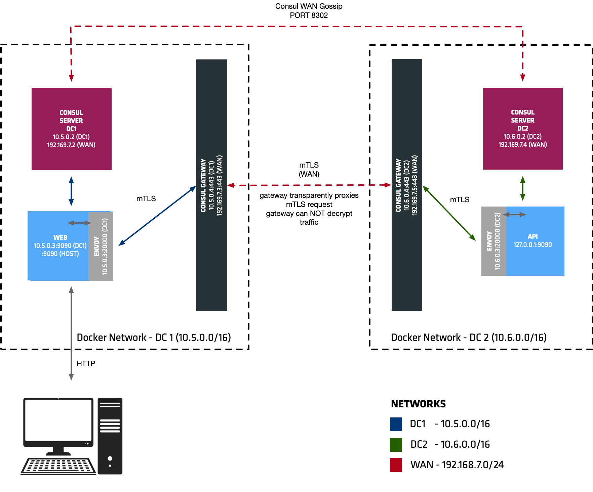

# Consul Demo

## Agenda
* Fail-over and scalability
* Routing - Split monolith
* Resolver - A/B
* GateWay

## Fail-over and scalability
> learn-consul-service-mesh

Done:
* api v1
* api v2


Run
```bash
docker-compose up -d
```

Check
```bash
curl -s localhost:9091 | jq
{
  "name": "web",
  "uri": "/",
  "type": "HTTP",
  "ip_addresses": [
    "10.5.0.3"
  ],
  "start_time": "2023-06-22T09:53:47.142208",
  "end_time": "2023-06-22T09:53:47.154115",
  "duration": "11.907833ms",
  "body": "Hello World",
  "upstream_calls": {
    "grpc://localhost:9092": {
      "name": "api-v1",
      "uri": "grpc://localhost:9092",
      "type": "gRPC",
      "ip_addresses": [
        "10.5.0.4"
      ],
      "start_time": "2023-06-22T09:53:47.146998",
      "end_time": "2023-06-22T09:53:47.147474",
      "duration": "475.708µs",
      "headers": {
        "content-type": "application/grpc",
        "date": "Thu, 22 Jun 2023 09:53:47 GMT",
        "server": "envoy",
        "x-envoy-upstream-service-time": "7"
      },
      "body": "Hello World",
      "code": 0
    }
  },
  "code": 200
}
```

try start v2 version
```bash
docker-compose -f docker-compose-success.yaml up -d
```

and faild one

```bash
docker-compose -f docker-compose-success.yaml down
docker-compose -f docker-compose-fail.yaml up -d
```

clean up
```bash
docker-compose -f docker-compose-fail.yaml down 
docker-compose down 
```


## Routing
> demo-consul-service-mesh/traffic_routing

### Split monolith

#### Simple router
Done:
* payment service - monolith
* currency service - new service split out from payment

At first we have route to currency
```bash
curl 127.0.0.1:9090/currency
{
  "name": "web",
  "uri": "/currency",
  "type": "HTTP",
  "ip_addresses": [
    "10.5.0.3"
  ],
  "start_time": "2023-06-22T08:28:24.435701",
  "end_time": "2023-06-22T08:28:24.602263",
  "duration": "166.56175ms",
  "body": "Hello World",
  "upstream_calls": {
    "http://localhost:9091": {
      "name": "payments-v1",
      "uri": "http://localhost:9091",
      "type": "HTTP",
      "ip_addresses": [
        "10.5.0.4"
      ],
      "start_time": "2023-06-22T08:28:24.546823",
      "end_time": "2023-06-22T08:28:24.548439",
      "duration": "1.616333ms",
      "headers": {
        "Content-Length": "263",
        "Content-Type": "text/plain; charset=utf-8",
        "Date": "Thu, 22 Jun 2023 08:28:24 GMT",
        "Server": "envoy",
        "X-Envoy-Upstream-Service-Time": "53"
      },
      "body": "Payments",
      "code": 200
    }
  },
  "code": 200
}
```

Lets tell service-mesh system what we're working with http protocol and define some route rules

```bash
consul config write web-defaults.hcl
consul config write payments-defaults.hcl
consul config write currency-defaults.hcl
consul config write payments-router.hc
```

and we got 
```bash
curl 127.0.0.1:9090/currency
{
  "name": "web",
  "uri": "/currency",
  "type": "HTTP",
  "ip_addresses": [
    "10.5.0.3"
  ],
  "start_time": "2023-06-22T08:32:40.371810",
  "end_time": "2023-06-22T08:32:40.627994",
  "duration": "256.182208ms",
  "body": "Hello World",
  "upstream_calls": {
    "http://localhost:9091": {
      "name": "currency",
      "uri": "http://localhost:9091",
      "type": "HTTP",
      "ip_addresses": [
        "10.5.0.5"
      ],
      "start_time": "2023-06-22T08:32:40.526798",
      "end_time": "2023-06-22T08:32:40.539170",
      "duration": "12.372ms",
      "headers": {
        "Content-Length": "258",
        "Content-Type": "text/plain; charset=utf-8",
        "Date": "Thu, 22 Jun 2023 08:32:40 GMT",
        "Server": "envoy",
        "X-Envoy-Upstream-Service-Time": "152"
      },
      "body": "Currency",
      "code": 200
    }
  },
  "code": 200
}
```


### Header based
Header based rule

```bash
consul config write payments-router-header.hcl
```

```bash
curl -H "x-v2-beta: true" 127.0.0.1:9090/currency
{
  "name": "web",
  "uri": "/currency",
  "type": "HTTP",
  "ip_addresses": [
    "10.5.0.3"
  ],
  "start_time": "2023-06-22T09:09:36.761705",
  "end_time": "2023-06-22T09:09:37.012901",
  "duration": "251.803208ms",
  "body": "Hello World",
  "upstream_calls": {
    "http://localhost:9091": {
      "name": "currency",
      "uri": "http://localhost:9091",
      "type": "HTTP",
      "ip_addresses": [
        "10.5.0.5"
      ],
      "start_time": "2023-06-22T09:09:36.915317",
      "end_time": "2023-06-22T09:09:36.925563",
      "duration": "10.245959ms",
      "headers": {
        "Content-Length": "261",
        "Content-Type": "text/plain; charset=utf-8",
        "Date": "Thu, 22 Jun 2023 09:09:36 GMT",
        "Server": "envoy",
        "X-Envoy-Upstream-Service-Time": "137"
      },
      "body": "Currency",
      "code": 200
    }
  },
  "code": 200
}
```

## Resolver - A/B
> demo-consul-service-mesh/traffic_resolver

```bash
curl -s localhost:9090 | jq
{
  "name": "web",
  "uri": "/",
  "type": "HTTP",
  "ip_addresses": [
    "10.5.0.3"
  ],
  "start_time": "2023-06-22T13:24:39.142701",
  "end_time": "2023-06-22T13:24:39.457910",
  "duration": "315.20925ms",
  "body": "Hello World",
  "upstream_calls": {
    "http://localhost:9091": {
      "name": "payments-v1",
      "uri": "http://localhost:9091",
      "type": "HTTP",
      "ip_addresses": [
        "10.5.0.4"
      ],
      "start_time": "2023-06-22T13:24:39.348155",
      "end_time": "2023-06-22T13:24:39.356077",
      "duration": "7.922458ms",
      "headers": {
        "Content-Length": "258",
        "Content-Type": "text/plain; charset=utf-8",
        "Date": "Thu, 22 Jun 2023 13:24:39 GMT",
        "Server": "envoy",
        "X-Envoy-Upstream-Service-Time": "164"
      },
      "body": "PAYMENTS V1",
      "code": 200
    }
  },
  "code": 200
}
```

insert config
```bash
consul config write ./central_config/web_service_defaults.hcl
consul config write ./central_config/payments_service_defaults.hcl
consul config write ./central_config/currency-defaults.hcl
consul config write ./central_config/payments_service_resolver.hcl
consul config write ./central_config/payments_service_router.hcl
```

```bash
curl -s -H "testgroup: b"  localhost:9090 | jq
{
  "name": "web",
  "uri": "/",
  "type": "HTTP",
  "ip_addresses": [
    "10.5.0.3"
  ],
  "start_time": "2023-06-22T13:29:47.884830",
  "end_time": "2023-06-22T13:29:47.966916",
  "duration": "82.085584ms",
  "body": "Hello World",
  "upstream_calls": {
    "http://localhost:9091": {
      "name": "payments-v2",
      "uri": "http://localhost:9091",
      "type": "HTTP",
      "ip_addresses": [
        "10.5.0.6"
      ],
      "start_time": "2023-06-22T13:29:47.927423",
      "end_time": "2023-06-22T13:29:47.955651",
      "duration": "28.227667ms",
      "headers": {
        "Content-Length": "877",
        "Content-Type": "text/plain; charset=utf-8",
        "Date": "Thu, 22 Jun 2023 13:29:47 GMT",
        "Server": "envoy",
        "X-Envoy-Upstream-Service-Time": "41"
      },
      "body": "PAYMENTS V2",
      "upstream_calls": {
        "http://localhost:9091": {
          "name": "currency",
          "uri": "http://localhost:9091",
          "type": "HTTP",
          "ip_addresses": [
            "10.5.0.5"
          ],
          "start_time": "2023-06-22T13:29:47.951922",
          "end_time": "2023-06-22T13:29:47.952263",
          "duration": "341.125µs",
          "headers": {
            "Content-Length": "259",
            "Content-Type": "text/plain; charset=utf-8",
            "Date": "Thu, 22 Jun 2023 13:29:47 GMT",
            "Server": "envoy",
            "X-Envoy-Upstream-Service-Time": "7"
          },
          "body": "2 USD for 1 GBP",
          "code": 200
        }
      },
      "code": 200
    }
  },
  "code": 200
}
```

## GW


At first:
```yaml
curl -s localhost:9090 | jq
{
  "name": "web",
  "uri": "/",
  "type": "HTTP",
  "start_time": "2023-06-22T12:46:57.667126",
  "end_time": "2023-06-22T12:46:57.728579",
  "duration": "61.453ms",
  "upstream_calls": [
    {
      "uri": "http://localhost:9091",
      "code": -1,
      "error": "Error communicating with upstream service: Get http://localhost:9091/: EOF"
    }
  ],
  "code": 500
}
```

Install configuration
```bash
consul config write ./central_config/web-defaults.hcl
consul config write ./central_config/currency-defaults.hcl
consul config write ./central_config/payments-defaults.hcl
consul config write ./central_config/currency-resolver.hcl
consul config write ./central_config/payments-resolver.hcl
```

Test
```bash
curl -s localhost:9090 | jq
{
  "name": "web",
  "uri": "/",
  "type": "HTTP",
  "start_time": "2023-06-22T12:50:37.778347",
  "end_time": "2023-06-22T12:50:38.371755",
  "duration": "593.408ms",
  "body": "Hello World",
  "upstream_calls": [
    {
      "name": "payments-dc2",
      "uri": "http://localhost:9091",
      "type": "HTTP",
      "start_time": "2023-06-22T12:50:38.021380",
      "end_time": "2023-06-22T12:50:38.282115",
      "duration": "260.735ms",
      "body": "PAYMENTS V2",
      "upstream_calls": [
        {
          "name": "currency-dc1",
          "uri": "http://localhost:9091",
          "type": "HTTP",
          "start_time": "2023-06-22T12:50:38.182726",
          "end_time": "2023-06-22T12:50:38.185280",
          "duration": "2.554ms",
          "body": "2 USD for 1 GBP",
          "code": 200
        }
      ],
      "code": 200
    }
  ],
  "code": 200
}
```

# APPENDIX
* https://github.com/nicholasjackson/demo-consul-service-mesh/tree/master
* https://github.com/nicholasjackson/fake-service
* https://github.com/nicholasjackson/fake-service/tree/main/examples
* https://github.com/hashicorp/learn-consul-service-mesh
* https://www.youtube.com/watch?v=Aq1uTozNajI